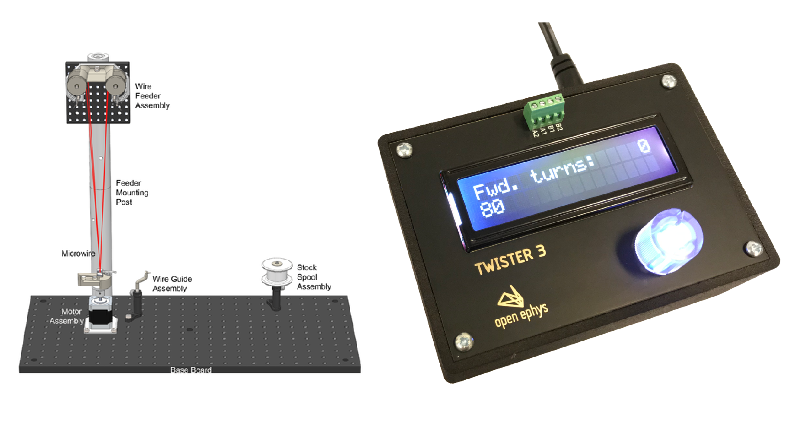

.. toctree::
    :hidden:

    pages/usingtwister.rst
    pages/assemblyguide.rst
    

.. title:: Home

|

**Twister3** is a fast microwire tetrode twister that's capable of twisting 70 tetrodes per hour. It has a high degree of repeatability thanks to a mechanism that keeps constant tension on the wire while twisting. It's fully open-source and easy to assemble.

.. raw:: html
      
     
    

        <a class="reference internal" href="pages/assemblyguide.html">
        

            
            

                <h5 class="card-title">Assembly Guide</h5>
                
Step-by-step guide to building Twister3.

            

        

        <a class="reference internal" href="pages/usingtwister.html">
        

            
            

                <h5 class="card-title">User Manual</h5>
                
Learn how to twist tetrodes.

            

        

        <a class="reference external" href="https://iopscience.iop.org/article/10.1088/1741-2552/ab77fa" target="_blank" rel="noopener noreferrer">
        

            
            

                <h5 class="card-title">Manuscript</h5>
                
Detailed characterization of this device.

            

        

        <a class="reference external" href = "https://open-ephys.org/twister-3/twister-3" target="_blank" rel="noopener noreferrer">
        

            
            

                <h5 class="card-title">Open Ephys Store</h5>
                
Buy Twister3 parts.

            

        

    

