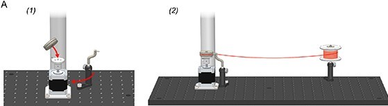
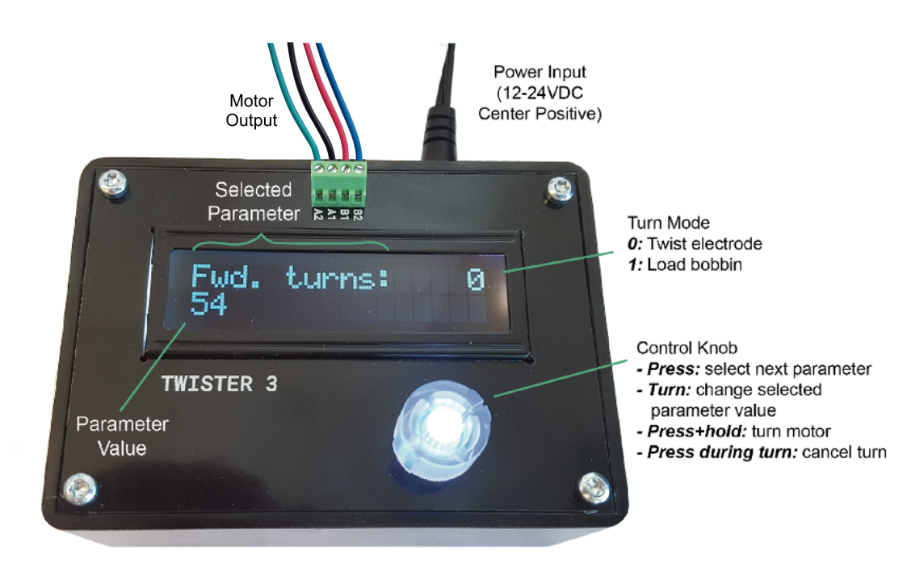
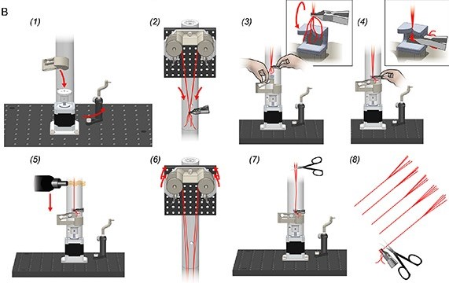
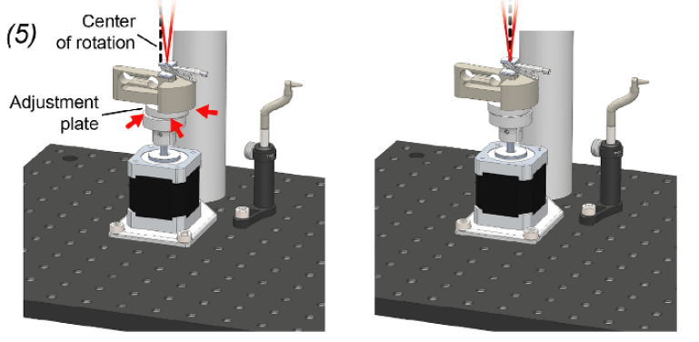

.. _userguide:

*************************************************
User Guide
*************************************************

.. contents:: Contents
    :local:
    :backlinks: none

Twister3 Usage Video
#######################################

.. raw:: html

    
<iframe width="392" height = "238" src="https://www.youtube.com/embed/xQbXc738ZuM" title="YouTube video player" frameborder="0" allow="accelerometer; autoplay; clipboard-write; encrypted-media; gyroscope; picture-in-picture" allowfullscreen></iframe>

Watch this video to learn how to load bobbins & twist tetrodes. See below for detailed information from the `manuscript <https://iopscience.iop.org/article/10.1088/1741-2552/ab77fa>`_

A) Loading Bobbins
#######################################

Before twisting electrodes, the bobbins on the wire feeder assembly must be loaded with microwire.

|

|

First, the bobbins must be removed from the wire feeder assembly. To do this, the wire shield is removed by unscrewing its M6-retention screw. Next, the bobbins are removed by unscrewing the M3 bolt that serves as the bobbin axle. The bobbins are then slipped off of each axle. If the bobbins have any left-over microwire, it should be removed and the wire grooves should be examined to ensure they are clean of dirt and debris. They can be wiped with a cotton swab and water if they require cleaning.

Next, the 3D-printed leaf spring is removed from the rotor base. Because each bobbin has embedded magnets that mate with those on the rotor base, after the leaf-spring is removed, a bobbin can be placed onto to rotor base (figure A1). Once the bobbin is in place and reasonably centered using the adjustment plate :ref:`(see final assembly step 5) <refcentering>`, the wire guide should be positioned such that its tip points directly into the center of the wire groove on the bobbin. Properly loaded bobbins will have microwire tightly wound around their center groove. This relies on carefully adjusting the position of the wire guide such that it is tip is located about 1–2 mm from the center groove (figure A1). After this, wire is feed from from the stock spool through the wire guide and wrapped once around the bobbin in its center groove (figure A2).

Finally, to load wire onto the bobbin, the controller is set to mode 1 and then the desired loading speed and number of revolutions are selected. We have found that 100 RPM works well for most wire. The circumference of the bobbin is ∼10 cm. Therefore, the length of wire loaded on the bobbin is: # turns × 10 cm. Including wastage, this results in a conservative estimate of 1 twisted wire probe (TWP) per turn. After the desired parameters have been entered, loading is started by pressing and holding the controller button.

.. note::
	Be careful to not touch moving parts during this process: the microwire needs to have constant tension to ensure it is properly loaded on the bobbin.

The loading processes should be monitored as it begins, to ensure that microwire is being accepted by the bobbin. If there is an issue, pressing the knob on the control unit will halt the process so it can be corrected. Once loading has completed, the process is repeated for the for the remaining bobbins. After each bobbin has be loaded with microwire, they are put back on their axle on the wire feeder assembly. Loose wire ends should point inward on both sides of the assembly (figure below, B2). Finally, the wire shield is replaced.

B) Making twisted wire probes
#######################################

The following steps detail TWP construction using Twister3. If you are interested in making stereotrodes instead of tetrodes, follow the same steps but only use two bobbins on diagonally opposing sides of the feeder.

|

.. raw:: html

    
<iframe width="392" height = "238" src="https://www.youtube.com/embed/B0MdM4z-wl0" title="YouTube video player" frameborder="0" allow="accelerometer; autoplay; clipboard-write; encrypted-media; gyroscope; picture-in-picture" allowfullscreen></iframe>

|

If it is not already in place, the leaf spring must be attached to the base rotor using its magnetic interface (figure B1). With the leaf spring in position, wire from each of the bobbins is grouped using a finger pitch. The bundle is then clamped using the alligator clip (figure B2). The wire bundle does not need to be in a certain position within the clip or be tightly grouped.

|

Additionally, each wire does not need to begin at exactly the same length from the feeder; wires with more slack will not pull on their bobbin until equal in length to the shortest wire. At the point that all wires are drawing slack, they will be equidistant from the wire feeder.

.. raw:: html

    
<iframe width="392" height = "238" src="https://www.youtube.com/embed/IROXmgvy4LA" title="YouTube video player" frameborder="0" allow="accelerometer; autoplay; clipboard-write; encrypted-media; gyroscope; picture-in-picture" allowfullscreen></iframe>

Once the wires are clamped in the alligator clip, it is flipped 180 degrees such that the wire bundle wraps around the bottom of the clip and exits its rear face (figure B3, inset). This will ensure that the wire does not slip out of the clip as it is draw from the feeder. Do not worry if the wire is not tightly bunched as the twist alignment jig will keep the bundle exactly concentric with the axis of rotation during twisting. Using your free hand, the twisting attachment's leaf spring is lifted until under slight tension, about 1.5 cm (figure B3). Then, with the leaf-spring raised, the alligator clip is drawn down to meet the magnet on the twisting attachment, feeding the bundle into the aignment jig (figure B4). After the clip is magnetically mated, the leaf spring is smoothly lowered until it is in equilibrium with the upward force produced by the wire. Each of the wires should be pulled straight. Do not let the spring snap back under its tension, as this will leave slack in the wires. If any wire has slack, its bobbin can be turned backwards slightly until it is taut. Finally, ensure all wires are guided through the center of the alignment jig (figure B4, inset)) and the loose ends are not interfering with the taught portion of the wire. If so, they should be cut before performing a twist.

Before performing the first twist in a session, ensure that the alignment plate has been adjusted so that the point at which the wire exits the alignment jig is co-axial with the motor shaft. To do this, adjust the position of the plate until until the point at which the wires enter the alignment jig entry point does not 'wobble' with respect to a steady background object when the motor is manually turned back and forth (figure below).

This should only need to be done once per session. After alignment, the controller is set to mode 0 and the desired number of turns and turn speed are selected. We use 900 RRM for our wire (table 1). These settings only need to be entered once because they are saved to non-volatile memory by the controller every time they are changed. The button is then pressed and held to start a twist.

.. raw:: html

    
<iframe width="392" height = "238" src="https://www.youtube.com/embed/o5eSvHRVRX8" title="YouTube video player" frameborder="0" allow="accelerometer; autoplay; clipboard-write; encrypted-media; gyroscope; picture-in-picture" allowfullscreen></iframe>

After the twist is complete, the wires are fused using hot air. The exact parameters of the hot air gun will be dependent on the melting point of microwire insulation material. For polyimide, we have found that 480° is a good temperature. We have found that the air flow is not critical, but should not be so high that it deforms the taught wire during the fusing process. Settings for our hot air gun are provided in table 1.

Once the air gun has reached a stable temperature, the nozzle is held ∼5 mm from the from the point at which the twisted microwires separate towards the feeder bobbins (figure B5). It is then moved downward slowly and smoothly (∼2 cm s−1) until it reaches the wire alignment jig. The direction is then reversed and it is raised until the nozzle returns to its initial position at the wire separation point. The nozzle is then moved away from the wire. Starting from the top and fusing downward is important: we have found that fusing from the bottom and moving upwards will cause the lower portion of the TWP to 'absorb' slack from above resulting in a very fine twist pitch and a TWP that is shorter than intended.

After wire fusing, both hands are used to simultaneously roll each of the bobbins forward until the leaf spring relaxes and there is no tension on the microwire (figure B6). The loose wire above the fused TWP is then cut using scissors (figure B7). When performing this cut, make sure to leave enough free wire for connectorization. Finally, the alligator clip is removed from the magnet in the wire alignment jig and the finished TWP is cut into a storage box (figure B8). The process can then be repeated for the next TWP.

C) Selecting device parameters
#######################################

Choosing twisting parameters will require some experimentation in order to produce twisted wire probes with the desired geometric and mechanical properties given the user's choice of wire, implant type, and animal model. Two settings of note are the height of the wire feeder above the motor assembly, which determines the probe length and microwire twist pitch and the bobbin stiction threshold which determines the wire tension during twisting and drawing. See `Figure 4 of the manuscript <https://iopscience.iop.org/article/10.1088/1741-2552/ab77fa#jneab77faf4>`_ for the effect of changing the wire feeder height on tetrode characteristics.

To test probe functionality and in the above guide, we produced tetrodes using the device settings in table 1:

.. image::  ../_static/images/table_1.png
  :align: center
  :alt: Table 1 tetrode parameters
